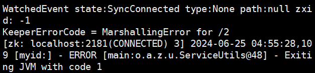

# Sieve
This is the artifact of "Understanding and Detecting Fail-Slow Hardware Failure Bugs in Cloud Systems".

Sieve is a fault injection tool for detecting bugs triggered by fail-slow hardwares.
## Overview
The artifact has the following structure:
- `src/`: contains the core components of Sieve
    - `src/client`: contains the failslow agent
    - `src/config`: contains configuration of Soot.
    - `src/failslow/Engine.java and src/scheduler/*`: injection controller contains the fault injection strategies in Sieve
    - `src/faultinjection/DelayInjection.java`: are used to inject failslow agent into cloud systems
    - `src/faultpointanalysis/*`: implement algorithms to identify synchronized and timeout-protected I/O points
    - `src/jsonutil/* and src/utils/*`: contains data strutures used to store information of I/O points and transfer information between failslow agent and injection controller
- `zookeeper, hadoop-3.3.6-src and kafka`: are the tested systems
- `XX_Config`: contains the configuration files of the tested systems (zoo.cfg for zookeeper)
- `buildXX.sh`: are used to build the clusters of the tested systems and Sieve
- `workloadDriver_XX.sh`: are used to drive the tested and contain parts of our checkers
- `bugstudy.md and bugstudy.xlsx`: are the studies of FSH failures in JIRA.
- `Makefile and Dockerfile`: are used to build env(container) for cloud systems.
## Getting Started
### Build dockers.
```shell
# build image
make build-image
# create containers and open four termials in the order
make run-container container_name=failslow1 id=1
make run-container container_name=failslow2 id=2
make run-container container_name=failslow3 id=3
make run-container container_name=failslow4 id=4
```
### Build the cluster for cloud systems
#### Take zookeeper as an example
After attaching containers, current dir is /failslow in containers. Run the following instruction to build Sieve and zookeeper.
```shell
# in failslow1,2,3
# this script may take about 30 minutes.
./buildzoo.sh 0 2
```
Additionally, buildXX.sh in this repo finishes two things
(1) compiles cloud systms
(2) invokes Sieve to analyze and inject failslow agents into cloud systems 
### Start testing cloud systems
#### Take zookeeper as an example
Run the following instruction to test zookeeper.
```shell
# start Sieve server in failslow4
# cur dir /failslow
./startEngine.sh zoo test_num(1)
#run workloadDriver.sh in failslow1,2,3
# cur dir /apache-zookeeper-3.10.0-SNAPSHOT-bin
./workloadDriver.sh test_num(1) id(1,2,3)
```
Moreover, you can get information of tested fault points in failslow4.
```
Engine | start server, port is 2359
Engine | start trial:1
SchedulerServiceImpl | timeout
SchedulerServiceImpl | className:org.apache.zookeeper.server.util.VerifyingFileFactory
SchedulerServiceImpl | funcName:create
SchedulerServiceImpl | lineNum:38
SchedulerServiceImpl | type:2
SchedulerServiceImpl | tId:1
SchedulerServiceImpl | nodeId:1
SchedulerServiceImpl | timeout:20000
SchedulerServiceImpl | scheduler:1
Engine | end trial:1
...
```
After testing, you can delete the containers, image and docker network using the following instruction.
```shell
make clean
```
## Reproduce ZK-4
In failslow4, run the script to test the buggy fault point in dir /failslow.
```shell
./reproduce_zk4_server.sh zoo 1
```
In failslow1,2,3, run the script to add minimized workloads in dir /apache-zookeeper-3.10.0-SNAPSHOT-bin.
```shell
# in failslow1
./reproduce_zk4_client.sh 1

# in failslow2
./reproduce_zk4_client.sh 2

# in failslow3
./reproduce_zk4_client.sh 3
```
You will get the following result in failslow3.



## References
```
Gen Dong, Yu Hua, Yongle Zhang, Zhangyu Chen, Menglei Chen, "Understanding and Detecting Fail-Slow Hardware Failure Bugs in Cloud Systems", Proceedings of the USENIX Annual Technical Conference (USENIX ATC), 2025.
```