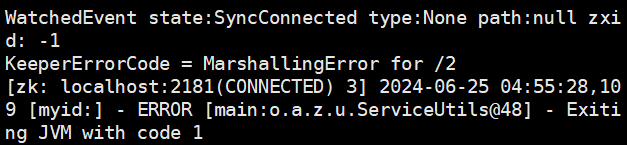

# Reproduce ZK-3
## Step1:Prepare the workload
```
# Move workload_dc* to /apache-zookeeper-3.10.0-SNAPSHOT-bin/bin
cp workload_dc* /apache-zookeeper-3.10.0-SNAPSHOT-bin/bin
cp workloadDriver_zoo_dc_* /apache-zookeeper-3.10.0-SNAPSHOT-bin/
```
## Step2:Replace SchedulerServiceImpl in Sieve server
```
rm -rf /src/main/java/scheduler/SchedulerServiceImpl.java
cp SchedulerServiceImpl.java /src/main/java/scheduler/
```
## Step3:Run test
```
# In Sieve server (failslow4)
./startEngine.sh zoo 1
# In failslow1,2,3
./workloadDriver_zoo_dc_1|2|3.sh 1 1|2|3
```
## Result
The third node get MarshallingError as following.


## Fault point
serialize